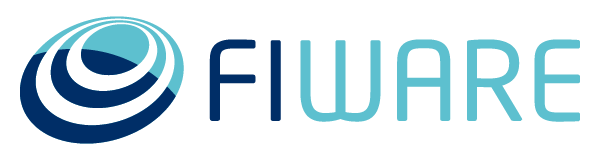
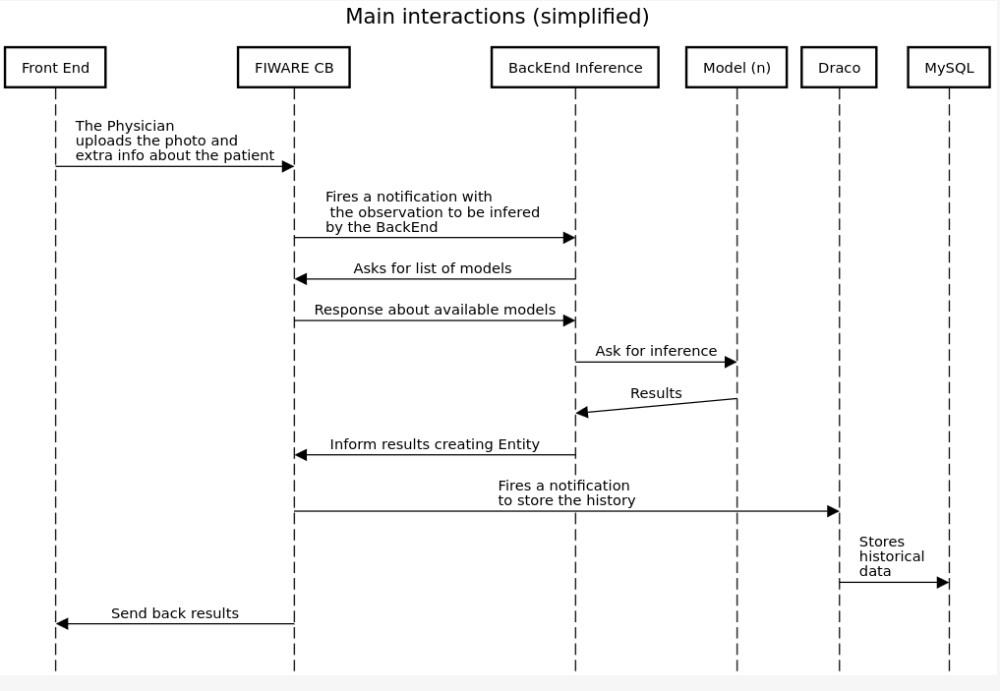

# FIWARE Global Summit 2024 ML-training
Training use case for the FIWARE Global Summit 2024 in Naples, Italy.

## Smart Health Tutorial - A Proof of Concept for screening skin diseases 

[]
[] [](https://www.fiware.org/)
<br/><br/>

[](https://ngsi-ld-tutorials.rtfd.io)
[](https://opensource.org/license/gpl-3-0)
[](https://stackoverflow.com/questions/tagged/fiware)


---


This is a use case example for health domain. The idea of this Proof of Concept (PoC) is to show how a medical image can be integrated into a Powered by FIWARE solution along with a Machine Learning (ML) model in order to perform predictions on observed images.
Any **NGSI** version could be used.
<br/>

---


## Warning Notice
> This Application is for **Demonstration Purposes Only**
>
> This application is a **Proof of Concept (PoC)** designed to demonstrate the underlying technology, including 
> *Machine Learning, Deep Learning, Keras, Python, FIWARE, JSON*, and other technical components.
>
>
> **Important: This application is not intended to be used as a medical tool or to provide medical advice.**
>
> - **DO NOT** use this application to make decisions about your or others health.
> - **DO NOT** rely on this application for the diagnosis or treatment of any medical condition.
>
> For any concerns regarding your health, skin moles, or any other medical issues, **please consult a qualified healthcare professional**.
>
> Your health and well-being should always be managed by a licensed medical professional. *This application is purely for demonstrating the potential of the technology* and **should not** be used as a substitute for professional medical advice, diagnosis, or treatment.
>

---


## Architecture


<br><br>

<br><br>
---


## Installation
To download this tutorial, simply clone this repository:

```console
gh repo clone dncampo/FGS2024_ML-training
```
or simply
```console
git clone https://github.com/dncampo/FGS2024_ML-training.git
```

If you want to create the CNN Models to perform inference, you should checkout the proper repository and put the models you are going to use under `ml-models` directory:

```console
git clone https://github.com/dncampo/cheetah.git
```

Or simply, just download the models I'm using and put them under the mentioned directory.
<br>
[[Binary model]](https://drive.google.com/file/d/1PFsg6uty8JKvjrry5CCXcCJXxz4NpkRD/view?usp=sharing)
<br><br>
[[Multiclass model]](https://drive.google.com/file/d/1aExZy6w1-bQDGuFmDeLbEQ1HqefaVdR4/view?usp=sharing)
<br>
---

## Run
To start the containers:

```console
./services [start | stop | build]
```

Will start or stop services - docker containers - respectively. With `create` param you should be able to download and / or create the containers without starting them.
source ~/venv/bin/activate

To start the front end:
```console
source ~/venv/bin/activate;
streamlit run app.py
```

Will activate the proper environent and start the Streamlit front end app.

## License

[GPL-v3](LICENSE)


[ngsiLdDefinitionLink]: https://www.etsi.org/deliver/etsi_gs/CIM/001_099/009/01.08.01_60/gs_cim009v010801p.pdfIf anybody is missing, please let me know.
